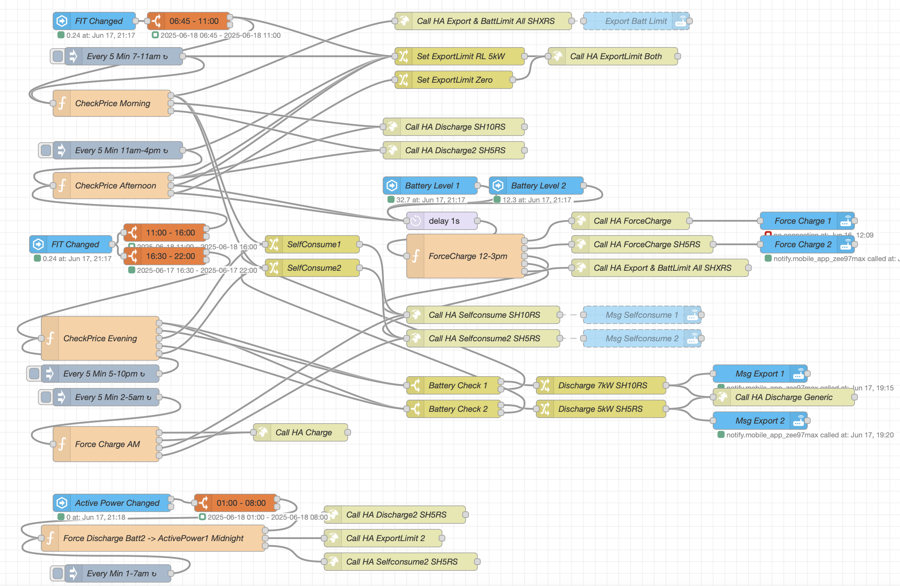
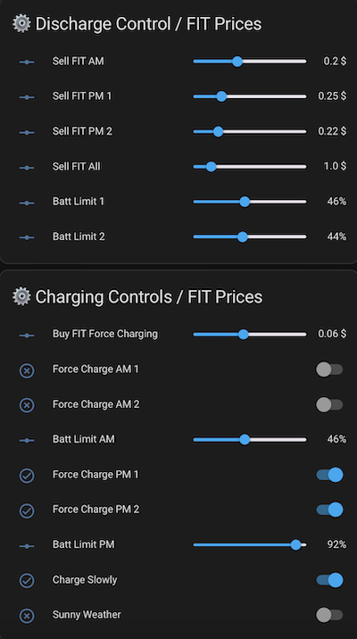

This repository folder contains information on how to modbus integration to Dual Sungrow Inverters in one Home Assistant instance. This is for advance users only.

# Prerequisite

1. Running version of Home Assistance (HA) at least 2024.8.3.
2. Please upgrade and remember to backup of your HA before proceed ! 
3. Two Sungrow Inverters not running on Master - Slave setup. It doesn't have to be identical.

## Copy the following files into the same folder structure under config

1. secrets.yaml
2. automations.yaml
3. configuration.yaml
4. dashboard.yaml

under integrations folder
1. modbus_sungrow.yaml
2. modbus_sungrow2.yaml
3. local_input_energy.yaml

## Configuration and restart HA

Modify the secrets.yaml and change the IP address of both your inverters.

Finally restart HA.

## NodeRed Automation Flow

I also developed a custom, fine-grained control system for both inverters using Node-RED.



File: nodered_sungrow.json

## Advance UI Controls

Developed advanced user interface controls for dynamic Buy/Sell FIT adjustment and battery charge/discharge management, with fine-grained inverter automation built in Node-RED.



File:  dashboard_fitchargecontrols.yaml

# Automations

To create new automation triggers, goto Settings -> Automations & Scenes then click Create Automation. On the top right corner, click on the 3 dots and select edit in YAML.


Below are some of the automations scripts I am running. 
Copy and paste into editor. Change the data value and triggers as needed.

## Battery Limit Charging

```jsx
alias: SG 7am battery charging
description: ""
trigger:
  - platform: time
    at: "07:00:00"
condition: []
action:
  - service: input_number.set_value
    data:
      value: 500
    target:
      entity_id: input_number.set_sg_battery_max_charge_power
mode: single

```

```jsx
alias: SG 10am battery charging
description: ""
trigger:
  - platform: time
    at: "10:00:00"
condition: []
action:
  - service: input_number.set_value
    data:
      value: 5000
    target:
      entity_id: input_number.set_sg_battery_max_charge_power
mode: single

```

# Current home assistant configuration

My current home configuration - Home Assistant Core Version 2024.8.3

1. Sungrow 5kW Hybrid Inverter SH10.0RS with 17x390W JA Panel (6630W) and 19X430W Trina 430NEG9R (8170W).
2. Sungrow 5kW Hybrid Inverter SH5.0RS with 22x430W Trina 430NEG9R28 Trina Panel (9460W).
3. Sungrow Battery 19.2kWh capacity
4. Sungrow Energy Monitor DTSU-666-20
5. Google Home Wifi Model GJ2CQ

# Links

- Modbus Protocol on Mkaiser https://github.com/mkaiser/Sungrow-SHx-Inverter-Modbus-Home-Assistant

- Webhooks & Shortcuts https://www.youtube.com/watch?v=ZXTI286DwYQ&t=633s

- AEMO Poll pricing https://github.com/cabberley/HA_AemoNemData
